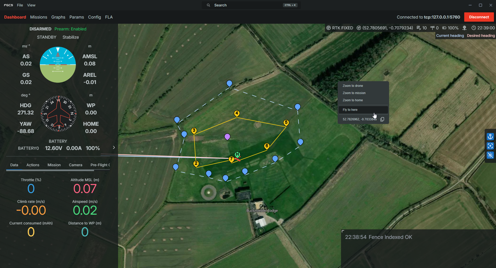

# FGCS

Falcon Ground Control Station.

## How to update

When adding a new folder please write up about it in the correct README.md and also ask for permission with folders (this is so that we don't end up with clutter, you will most likely be allowed to add it).

## How to run

1. Install concurrently with `npm i concurrently -g`
2. Make sure that you are in your virtual environment and then run `./run.bat` and both the frontend and backend will load. If you want to do run them individually then:

### Running Frontend Manually

1. `cd gcs`
2. `yarn dev`

### Running Backend Manually

1. Make sure you're in a virtual environment with `requirements.txt` installed
2. python app.py

## Stack

- GUI
  - Electron + Vite + React (JavaScript)
- Radio
  - Python
  - C++

## Python Version

We are going to be using **python 3.9.13** so please install that on your computer from [Python's website](https://www.python.org/downloads/). Please try to use a virtual environment when programming, if you don't know how to do this please message me (Julian)! Name the folder either "env" or "venv" so its in the .gitignore as we don't want to be uploading that to github.

## Python Code Style

We will be using `ruff` as the code style for python, please look at the documentation found [here](https://docs.astral.sh/ruff/). When pushing code we have an action to check if it is in the correct code style, if it is not in the correct style it will fail the run and you will need to fix it by running `python -m ruff format .` in your virtual environment (or something `ruff format .` works on different systems); this should automatically reformat everything so you can push it again!

## Pre-commit

When cloning the repo for the first time, please install `pre-commit`. This can be done with a simple `pip install pre-commit` and then `pre-commit install`. Our pre-commit hooks will run every time you try to push something, if any of the checks fail then you will not be able to push that commit and receive an error message, often the files will be fixed but not staged, so make sure to re-stage and retry the with pushing commit.
