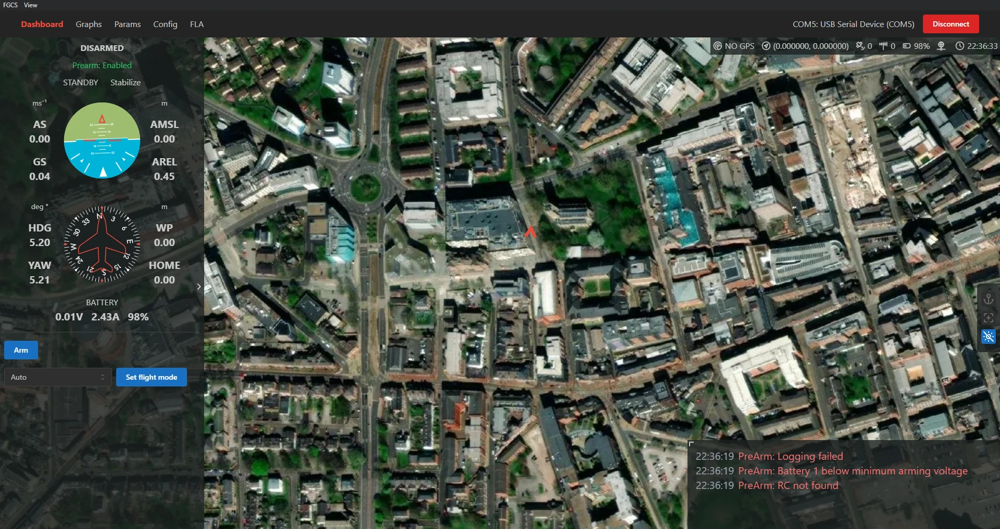

# FGCS

Falcon Ground Control Station.

> Learn more on our [website](https://fgcs.projectfalcon.uk)!



---

## How to run

<details><summary>Windows - Installation</summary>

1. Go to [releases](https://github.com/Avis-Drone-Labs/FGCS/releases) and download the most recent versions `.exe` file
2. Run the downloaded file, you may have to click "more" then "run anyway" if windows defender blocks it
3. Once installed it should be accessible via the start menu as "FGCS"

</details>

<details><summary>Windows - Manually</summary>

### Prerequsits

1. Ensure npm is installed, to do so follow [this guide](https://kinsta.com/blog/how-to-install-node-js/). Note: node version must be >= v20.10.0
2. Ensure yarn is installed, to do so run `npm install --global yarn` or follow [this guide](https://classic.yarnpkg.com/lang/en/docs/install/#windows-stable)
3. We are using `python 3.11.9` so make sure its installed before creating the venv. If you have multiple environments then please run `python3.11 -m venv venv`

### Running Frontend Manually

1. `cd gcs`
2. `yarn` (to install dependencies)
3. `yarn dev`

### Running Backend Manually

1. `cd radio`
2. Make sure you're in a virtual environment (or create one via `python3 -m venv venv`) and all dependencies are installed using `pip install -r requirements.txt`

> NOTE: To enter the virtual environment you will need to run `venv/Scripts/activate` on windows, to learn more please read: [how to make venv for linux and winodws](https://www.geeksforgeeks.org/creating-python-virtual-environment-windows-linux/) or [what is a virtual environment?](https://docs.python.org/3/library/venv.html)

4. `python app.py`

#### Creating a virtual environment

Create a new Python virtual environment using `python -m venv venv`. This can then be activated using `./venv/scripts/activate`.

### Running both simultaneously

> NOTE: You don't _need_ to run them at the same time with 1 command, you can run each one individually in separate terminals

To run both the frontend and backend at the same time, you need to make sure all the requirements are installed for both yarn and Python. Then you can install a script globally using `npm install -g concurrently`. After activating your Python virtual environment, you can run `./run.bat` and this should start up both the frontend and backend in one terminal.

</details>

<details><summary>Mac/Linux</summary>

We currently dont have instructions or releases for mac or linux, we will in future releases. It does run on ubuntu and mac as members of the team use it, but we want to test the instructions before releasing them. Howerver, you can still run both the frontend and backend indivudally by following the windows version with slight alterations to the commands.

</details>

---

## Development Info

<details><summary>Stack</summary>

- GUI
  - Electron + Vite + React (JavaScript)
- Backend
  - Flask (Python)

</details>

<details><summary>Running tests</summary>

## Backend

For running Python tests, first make sure you're in the `radio` directory. By default the tests will attempt to connect to the simulator running within Docker. To run the tests simply run `pytest`. To use a physical device connected to your computer, you can use `pytest --fc -s` and a prompt will display to select the correct COM port for the device.

</details>

<details><summary>SITL with Docker</summary>

To run the SITL simulator within Docker, first pull the docker image with `docker pull kushmakkapati/ardupilot_sitl`. Once pulled, you can start the container with `docker run -it --rm -p 5760:5760 kushmakkapati/ardupilot_sitl`. This will expose port 5760 for you to connect to over TCP on 127.0.0.1 (the connection string is `tcp:127.0.0.1:5760`).

Note: Steps to push an updated image to docker hub:

```plaintext
docker build . -t ardupilot_sitl
docker tag ardupilot_sitl:latest kushmakkapati/ardupilot_sitl:latest
docker push kushmakkapati/ardupilot_sitl:latest
```

</details>

<details><summary>Python</summary>

## Version

We are going to be using **python 3.11.x** so please install that on your computer from [Python's website](https://www.python.org/downloads/). Please try to use a virtual environment when programming, if you don't know how to do this please message me (Julian)! Name the folder either "env" or "venv" so its in the .gitignore as we don't want to be uploading that to github.

## Code Style

We will be using `ruff` as the code style for python, please look at the documentation found [here](https://docs.astral.sh/ruff/). When pushing code we have an action to check if it is in the correct code style, if it is not in the correct style it will fail the run and you will need to fix it by running `python -m ruff format .` in your virtual environment (or something `ruff format .` works on different systems); this should automatically reformat everything so you can push it again!

</details>

<details><summary>Pre-Commit</summary>

When cloning the repo for the first time, please install `pre-commit`. This can be done with a simple `pip install pre-commit` and then `pre-commit install`. Our pre-commit hooks will run every time you try to push something, if any of the checks fail then you will not be able to push that commit and receive an error message, often the files will be fixed but not staged, so make sure to re-stage and retry the with pushing commit.

</details>

<details><summary>Packaging</summary>

## Backend

From within the `radio` folder run `pyinstaller --paths .\venv\Lib\site-packages\ --add-data=".\venv\Lib\site-packages\pymavlink\message_definitions\:message_definitions" --add-data=".\venv\Lib\site-packages\pymavlink\:pymavlink" --hidden-import pymavlink --hidden-import engineio.async_drivers.threading .\app.py -n fgcs_backend`. This will create an exe and folder within the `dist/fgcs_backend/` folder.

## Frontend

After compiling the backend, place the contents of `radio/dist/fgcs_backend` into a folder in `gcs/extras`. Then from within the `gcs` folder run `yarn build`.

</details>

---

## Need Help?

Feel free to ask questions in the [discussion area](https://github.com/Avis-Drone-Labs/FGCS/discussions).
